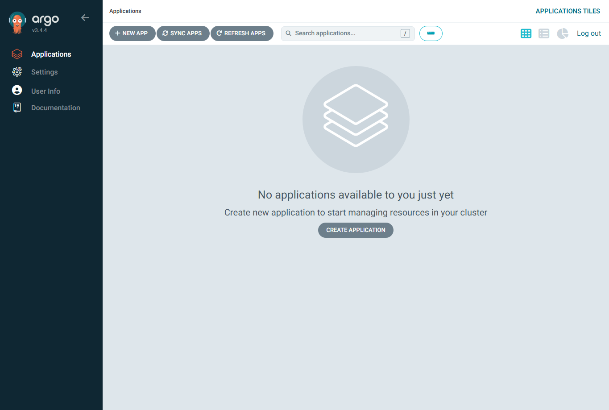
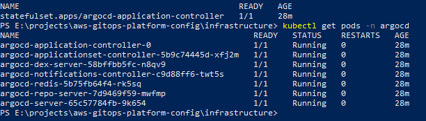
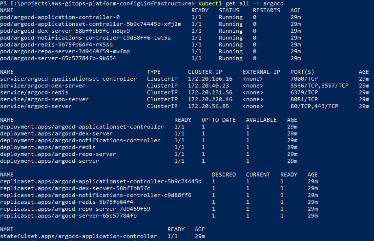

# ArgoCD module

Installs ArgoCD onto the EKS cluster via the community argo-cd Helm chart, using Terraform's helm provider. ArgoCD is the GitOps engine for the platform: it watches this config repository and reconciles the cluster state to match what is declared in Git.

## What this module creates

- **A dedicated `argocd` namespace**, created explicitly as a `kubernetes_namespace` resource so its lifecycle is tracked in Terraform state.
- **An ArgoCD installation** via `helm_release`, pinned to a specific chart version, in its non-HA form suitable for a dev platform.

## Design choices

- **Self-installed via Helm, not the AWS-managed EKS Capability.** See ADR-0002. Installing ArgoCD myself demonstrates the platform-engineering work, avoids the per-hour managed-capability cost, and keeps the whole platform reproducible from a single `terraform apply`.
- **ClusterIP service, not a public LoadBalancer.** The ArgoCD server stays internal. The UI is reached with `kubectl port-forward`. This keeps the install free (no ELB cost) and avoids exposing ArgoCD to the internet in a dev environment.
- **`wait = true` with a 10 minute timeout.** Terraform blocks until all ArgoCD components are Ready, so a successful apply means a genuinely running ArgoCD rather than pods still starting.
- **Explicit namespace resource.** Rather than letting Helm create the namespace, the module creates it so labels can be attached and the namespace is visible in state.

## Provider configuration

This module uses the helm and kubernetes providers, both configured at the root using the EKS cluster endpoint, CA certificate, and an `aws eks get-token` exec call for short-lived authentication. The module declares the provider requirements but does not configure them; provider configuration lives at the root per Terraform best practice.

## Accessing the ArgoCD UI

After apply, port-forward the server service and log in:

```
kubectl port-forward svc/argocd-server -n argocd 8080:443
```

Then browse to https://localhost:8080. The initial admin password is stored in a Kubernetes secret created by the chart. Retrieve it with:

```
kubectl -n argocd get secret argocd-initial-admin-secret -o jsonpath="{.data.password}" | base64 -d
```

The username is `admin`.

## Inputs

See `variables.tf`. Key inputs:

- `namespace`: defaults to `argocd`.
- `chart_version`: the argo-cd Helm chart version, pinned for reproducibility.

## Outputs

See `outputs.tf`. Includes the namespace, release name, installed chart version, and the server service name used for port-forwarding.

## Verified deployment

This module has been applied successfully and ArgoCD is running in the cluster. Screenshots are committed under [docs/screenshots/argocd/](../../../docs/screenshots/argocd/) at the repo root. These screenshots contain no account-identifying information, so no redaction was needed.

### Dashboard

After applying the module and port-forwarding the server service, the ArgoCD web UI is reachable and accepts the admin login. The dashboard shows no applications yet, which is correct: this module installs the ArgoCD engine, but the Application manifests that tell ArgoCD what to watch are added separately.



### Running pods

All seven ArgoCD components are Running with zero restarts: the application controller, applicationset controller, dex server, notifications controller, Redis, repo server, and the API/UI server. Because the Helm release was applied with `wait = true`, the Terraform apply only completed once every one of these pods reported Ready.



### Full resource set

The complete set of Kubernetes objects created by the Helm release: pods, services, deployments, replicasets, and the application controller statefulset. Every service is of type ClusterIP, confirming the design choice to keep ArgoCD internal rather than exposing it through a public LoadBalancer. The UI is reached with `kubectl port-forward` instead.


