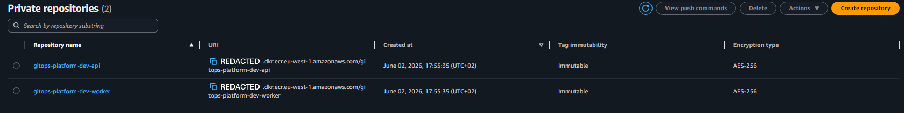
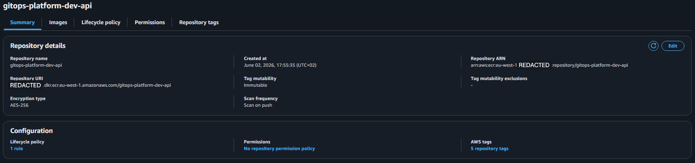
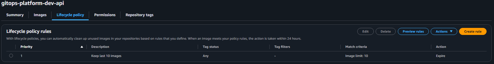

# ECR module

Creates one Amazon ECR repository per service in the platform. Each repository is configured for security and GitOps-friendly image management.

## What this module creates

- **One ECR repository per service** passed in `service_names`. For this project: `gitops-platform-dev-api` and `gitops-platform-dev-worker`.
- **Image scanning on push** is enabled. AWS scans every uploaded image against the CVE database and surfaces vulnerabilities in the AWS console.
- **Immutable tags**. Once a tag like `v1.2.3` is pushed, it can never be overwritten. This is essential for GitOps: the config repo references images by tag, and a mutable tag would let someone silently change what runs in the cluster without a Git commit.
- **AES256 encryption at rest** (default, free).
- **Lifecycle policy** that retains the most recent N images per repository and deletes older ones. Default is 10. This caps storage cost and keeps the repository clean.

## Tag immutability and the GitOps flow

The CI pipeline in the app repo builds an image and tags it with the Git commit SHA. It then commits an update to the Kustomize manifests in the config repo, pointing at that new SHA-tagged image. ArgoCD syncs. With immutable tags, the chain of evidence is auditable: every running image traces back to a specific commit, and no one can silently change what `v1.0.0` means.

## Inputs

See `variables.tf`. Key inputs:

- `service_names`: list of services that get a repository each.
- `image_tag_mutability`: `IMMUTABLE` (default) or `MUTABLE`.
- `scan_on_push`: defaults to true.
- `max_image_count`: defaults to 10.

## Outputs

See `outputs.tf`. The map outputs let downstream modules and workflows look up a repository URL by service name:

```
module.ecr.repository_urls["api"]
module.ecr.repository_urls["worker"]
```

## Verified deployment

This module has been applied successfully and the two repositories are visible in the AWS console. Screenshots are committed under [docs/screenshots/ecr/](../../../docs/screenshots/ecr/) at the repo root. Account IDs are redacted from screenshots.

### Repository list

Both repositories appear in the Private repositories view, each with `Immutable` tag mutability and `AES-256` encryption. The shared timestamp confirms they were created by the same `terraform apply`.



### Repository details

Clicking into `gitops-platform-dev-api` shows the configuration that matters for GitOps: tag mutability is `Immutable` (so a given image tag can never be overwritten), the encryption type is `AES-256`, and scan frequency is `Scan on push` (every uploaded image is scanned against the CVE database). The repository is empty because no images have been pushed yet; that happens later via the CI pipeline in the app repo.



### Lifecycle policy

The lifecycle policy keeps the 10 most recent images and expires the rest. Without this, every CI build would accumulate in the repository indefinitely, slowly growing the storage bill and making the registry harder to navigate. With it, the repository stays clean and the cost stays predictable.


