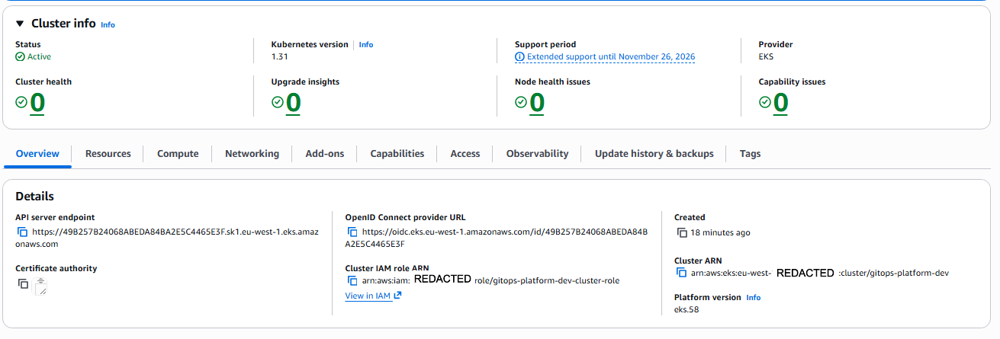
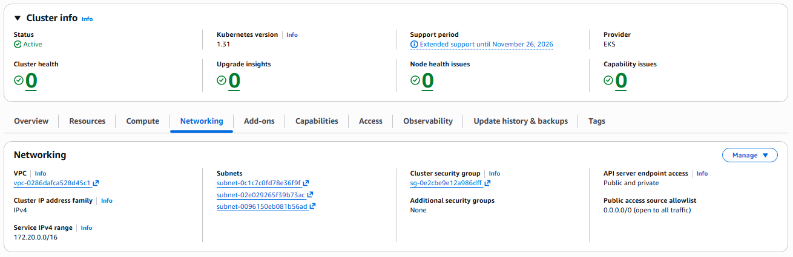
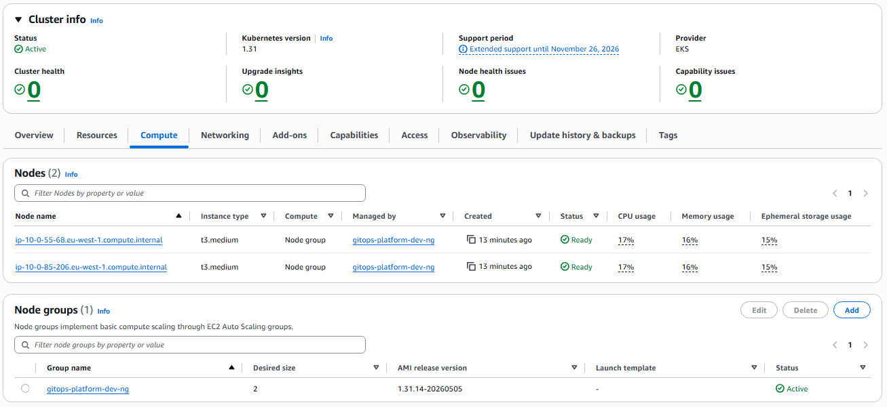
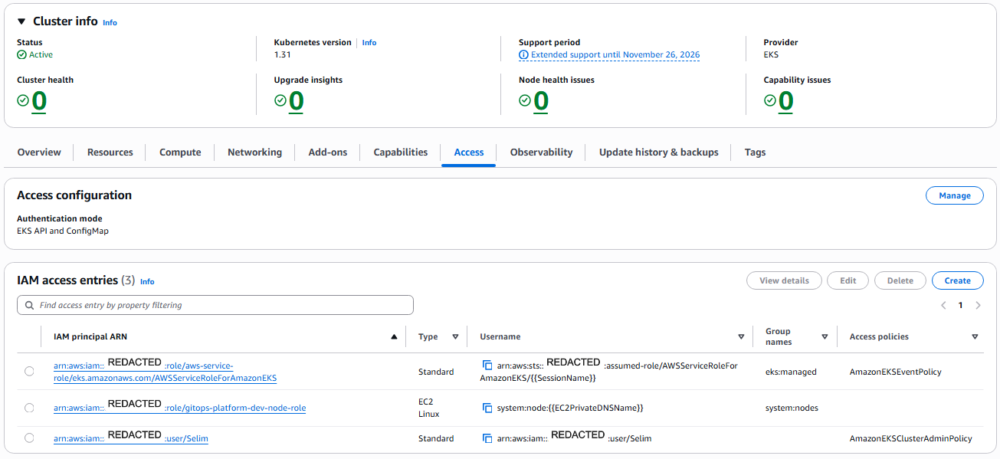
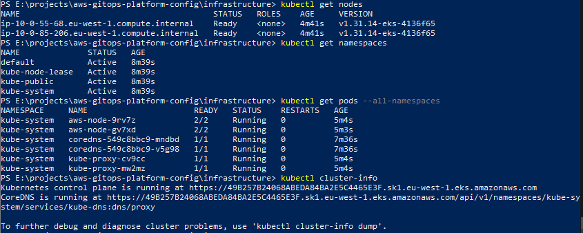

# EKS module

Creates an Amazon EKS cluster with a managed node group, the IAM roles required for both the control plane and nodes, and the OIDC provider needed for IRSA (IAM Roles for Service Accounts).

## What this module creates

- **EKS cluster control plane** running the specified Kubernetes version, in the private subnets supplied by the VPC module.
- **Cluster IAM role** with the `AmazonEKSClusterPolicy` managed policy attached.
- **Managed node group** with on-demand EC2 instances in the private subnets.
- **Node IAM role** with the worker, CNI, and ECR read-only managed policies attached.
- **OIDC provider** registered with IAM so pods can assume IAM roles via web identity tokens (IRSA).
- **Cluster access entry** granting an IAM principal (passed as input) the `AmazonEKSClusterAdminPolicy`, so the principal can `kubectl` against the cluster.

## Authentication mode

The cluster uses `API_AND_CONFIG_MAP` authentication mode. This is the modern hybrid that supports both EKS access entries (the newer API-driven approach) and the legacy `aws-auth` ConfigMap. New principals are added via `aws_eks_access_entry` and `aws_eks_access_policy_association` resources, not by editing the ConfigMap.

## Endpoint access

Both public and private endpoints are enabled. Public access is required so the cluster can be administered from a local workstation without a VPN. Private access is enabled so workloads inside the VPC reach the API through the AWS network rather than the public internet.

## Cost

This module brings up the meaningful compute cost of the platform.

| Resource | Approximate cost |
|---|---|
| EKS control plane | $0.10/hour |
| 2x t3.medium nodes (on-demand) | $0.084/hour combined |
| Per-cluster logging to CloudWatch | Negligible at this volume |

Total roughly $0.18/hour while running, plus the existing $0.045/hour from the VPC NAT Gateway.

## Inputs

See `variables.tf`. Key inputs:

- `vpc_id`, `private_subnet_ids`: supplied from the VPC module outputs.
- `cluster_version`: defaults to `1.31`.
- `node_instance_types`, `node_desired_size`, `node_min_size`, `node_max_size`: node group sizing.
- `cluster_admin_principal_arn`: ARN of the IAM user or role to grant cluster-admin access. Leave empty to skip.

## Outputs

See `outputs.tf`. Most important downstream:

- `cluster_name`, `cluster_endpoint`, `cluster_certificate_authority_data`: needed for `kubectl` access and for Helm providers.
- `oidc_provider_arn`, `oidc_provider_url`: needed by IRSA trust policies for service-account-bound IAM roles.

## Verified deployment

This module has been applied successfully and verified end-to-end: cluster up, nodes registered, kubectl access working from a local workstation. Screenshots are committed under [docs/screenshots/eks/](../../../docs/screenshots/eks/) at the repo root. Account IDs are redacted from screenshots.

### Cluster overview

The cluster `gitops-platform-dev` is Active, running Kubernetes 1.31, with cluster health, upgrade insights, node health, and capability issues all at zero. The Cluster IAM role and Cluster ARN are visible in the details panel.

### Networking

The Networking tab confirms the cluster is wired to the project VPC (`vpc-0286...`), with all three private subnets attached, the cluster security group provisioned, and API server endpoint access set to "Public and private" so the cluster can be administered from a local workstation while in-VPC workloads reach the API privately.

### Compute and node group

Two t3.medium on-demand nodes are registered and Ready, both managed by the `gitops-platform-dev-ng` node group. The node group is Active with a desired size of 2 and the current EKS-optimised AMI release version.

### Access entries

The Access tab shows the cluster is in `EKS API and ConfigMap` authentication mode. Three IAM principals have access entries: the AWS service role for EKS itself, the node role (granting nodes the `system:nodes` group), and my IAM user `Selim` with the `AmazonEKSClusterAdminPolicy` attached. The admin grant for my user is created explicitly via Terraform (`aws_eks_access_policy_association.admin`), not via the legacy `bootstrap_cluster_creator_admin_permissions` flag, so the grant is visible in code rather than implicit.

### kubectl verification

End-to-end proof from the local workstation: after running `aws eks update-kubeconfig`, the cluster responds to `kubectl get nodes` (both nodes Ready), `kubectl get namespaces` (four default namespaces), `kubectl get pods --all-namespaces` (aws-node, coredns, and kube-proxy all Running), and `kubectl cluster-info` (control plane and CoreDNS endpoints).

