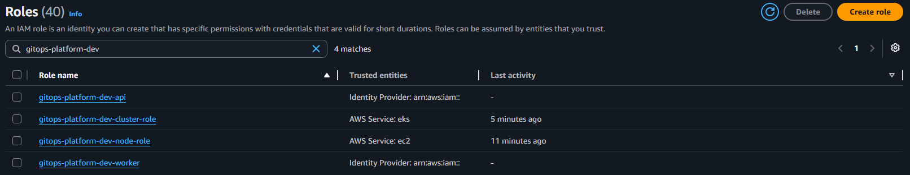
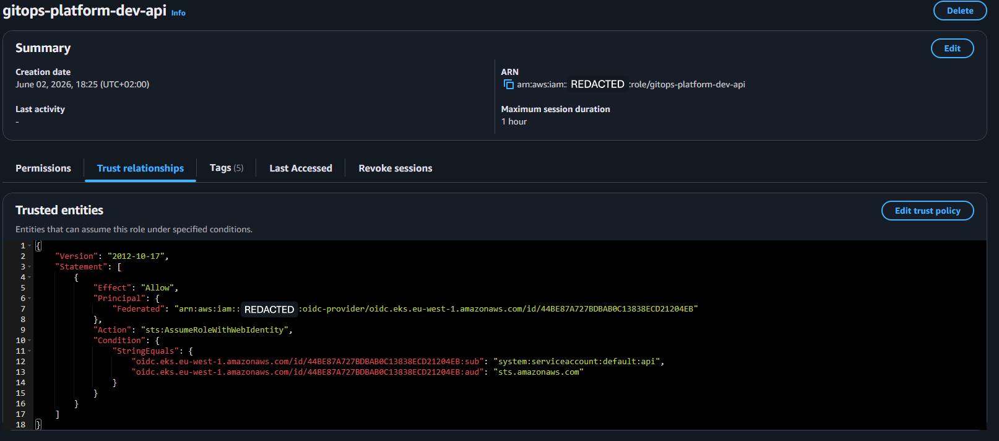
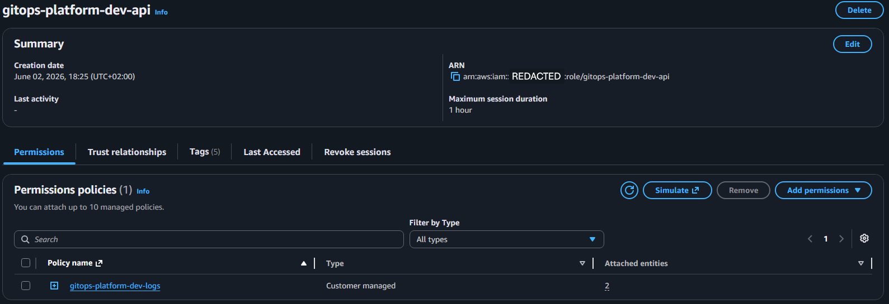

# IAM module

Creates IRSA (IAM Roles for Service Accounts) roles that map specific Kubernetes ServiceAccounts to least-privilege IAM permissions. Each pod gets its own scoped AWS access via short-lived web identity tokens, with no long-lived credentials stored in the cluster.

## What this module creates

- **One IAM role per service** (api, worker). Each role has a trust policy that allows assumption only by its matching Kubernetes ServiceAccount.
- **CloudWatch Logs policy** attached to both roles. Scoped to log groups under `/aws/eks/gitops-platform-dev/*`.
- **SQS publish policy** for the API role (when `sqs_job_queue_arn` is provided). Grants `SendMessage`, `GetQueueAttributes`, `GetQueueUrl` on the job queue only.
- **SQS consume policy** for the worker role (when `sqs_job_queue_arn` is provided). Grants `ReceiveMessage`, `DeleteMessage`, `ChangeMessageVisibility`, `GetQueueAttributes`, `GetQueueUrl` on the job queue only.
- **Secrets Manager read policy** for the worker role (when `db_secret_arn` is provided). Grants `GetSecretValue` on the database secret only.

## How IRSA works in this module

Each role's trust policy contains three conditions that together pin down exactly who can assume it:

1. **Federated principal**: only tokens signed by this cluster's OIDC provider are accepted.
2. **Subject claim**: the token's `sub` field must match `system:serviceaccount:<namespace>:<service-name>`. So the api role can only be assumed by a ServiceAccount literally named `api` in the configured namespace.
3. **Audience claim**: standard `sts.amazonaws.com` audience required by AWS STS.

When the Helm charts for the api and worker are deployed, their ServiceAccount manifests will be annotated with `eks.amazonaws.com/role-arn` pointing at the matching role ARN from this module. The EKS pod identity webhook will then inject a web identity token into each pod, and AWS SDKs inside the container will exchange that token for temporary credentials scoped to the role's permissions.

## Least privilege

Every permission policy is scoped to exact resource ARNs. The API role can publish to the SQS job queue and nothing else. The worker role can consume from that queue and read the database secret, and nothing else. Neither role has broad `sqs:*` or `secretsmanager:*` permissions; if either pod is compromised, the blast radius is limited to its single function.

## Deferred wiring

`sqs_job_queue_arn` and `db_secret_arn` default to empty strings because the SQS and RDS modules do not exist yet. When those modules come online, their ARNs will be passed in via the root configuration and the conditional policies will be attached automatically. This keeps the IAM module deployable today without dangling references.

## Inputs

See `variables.tf`. Key inputs:

- `oidc_provider_arn`, `oidc_provider_url`: from the EKS module outputs.
- `service_namespace`: Kubernetes namespace where the ServiceAccounts live. Defaults to `default`.
- `sqs_job_queue_arn`, `db_secret_arn`: deferred ARNs. Leave empty until the corresponding modules exist.

## Outputs

See `outputs.tf`. The map outputs let downstream Helm charts look up a role ARN by service name:

```
module.iam.service_role_arns["api"]
module.iam.service_role_arns["worker"]
```

## Verified deployment

This module has been applied successfully and both IRSA roles are visible in the AWS console. Screenshots are committed under [docs/screenshots/iam/](../../../docs/screenshots/iam/) at the repo root. Account IDs are redacted from screenshots.

### Role list

Four roles appear under the `gitops-platform-dev` naming prefix. Two are from the EKS module (cluster control plane role, node group role), and two are the new IRSA roles for the API and worker services. The "Trusted entities" column shows the two EKS roles are trusted by AWS services (eks, ec2), while the two IRSA roles are trusted by an Identity Provider, which is the cluster's OIDC issuer.



### IRSA trust policy

The API role's trust policy is the heart of how IRSA works. The `Principal.Federated` field points at the cluster's OIDC provider, the `Action` is `sts:AssumeRoleWithWebIdentity`, and two `Condition` checks pin the trust down: the `sub` claim must match exactly `system:serviceaccount:default:api`, and the `aud` claim must be `sts.amazonaws.com`. Together these conditions mean only a pod running with the `api` ServiceAccount in the `default` namespace, with a token signed by this specific cluster, can assume this role.

The worker role has the same structure with `system:serviceaccount:default:worker` in the `sub` condition.



### Attached permissions

The Permissions tab shows the API role has exactly one customer-managed policy attached: `gitops-platform-dev-logs`. The "Attached entities" count of 2 reflects that the same policy is shared between the API and worker roles. The policy itself is scoped to log groups under `/aws/eks/gitops-platform-dev/*`, not the entire CloudWatch Logs surface. SQS and Secrets Manager policies are not yet attached because the SQS and RDS modules have not been deployed; their wiring will activate automatically when those modules come online.


