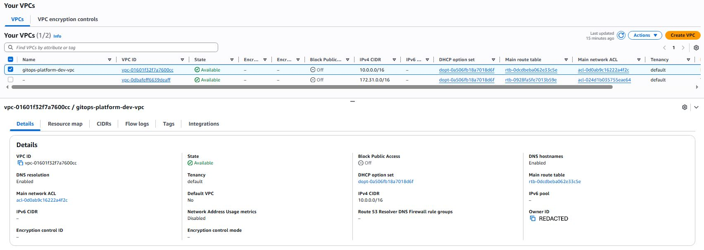
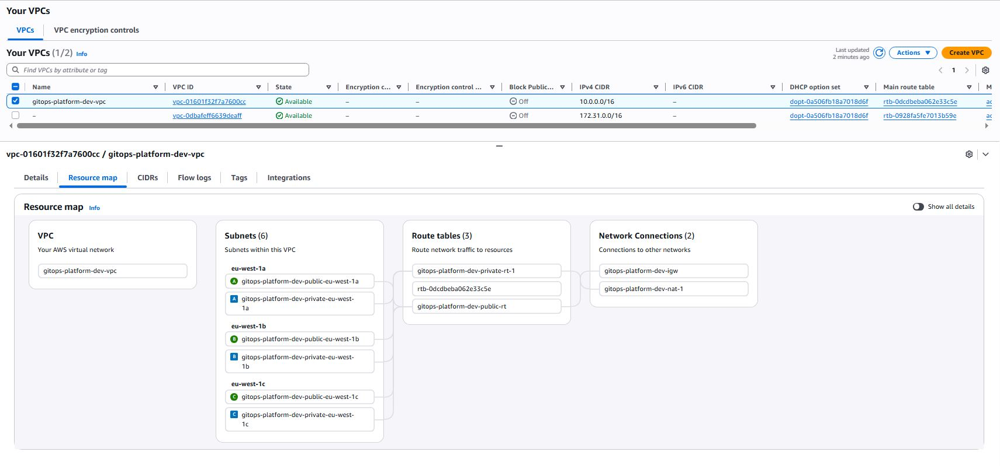
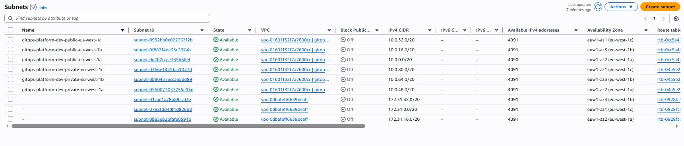
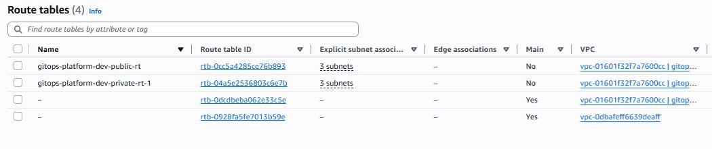
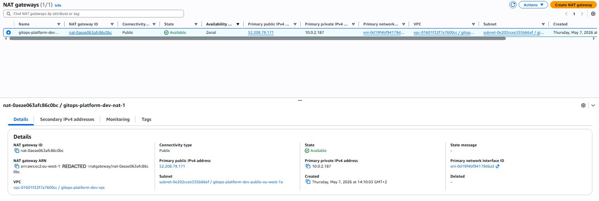

# VPC module

Creates the network foundation for the platform: a VPC with public and private subnets across multiple availability zones, an Internet Gateway, and NAT Gateways for private subnet egress.

## Layout

- VPC with CIDR `10.0.0.0/16` by default.
- 3 public subnets and 3 private subnets, one of each per availability zone.
- Internet Gateway attached to the VPC.
- NAT Gateway in the first public subnet (default: single NAT for cost). Set `single_nat_gateway = false` for one NAT per AZ in production.
- Public route table routing `0.0.0.0/0` to the Internet Gateway.
- Private route tables routing `0.0.0.0/0` to the NAT.

## EKS-aware tagging

Public subnets are tagged with `kubernetes.io/role/elb = 1` and private subnets with `kubernetes.io/role/internal-elb = 1`. This lets the AWS Load Balancer Controller automatically pick the right subnets for internet-facing and internal load balancers.

## Inputs

See `variables.tf`. Key inputs:

- `project_name`, `environment`: combined to form a name prefix used in tags and resource names.
- `aws_region`: the region the VPC lives in.
- `vpc_cidr`: defaults to `10.0.0.0/16`.
- `az_count`: 2 or 3, defaults to 3.
- `single_nat_gateway`: defaults to true (one NAT for the whole VPC). Set to false for one-per-AZ HA.

## Outputs

See `outputs.tf`. The most important outputs for downstream modules:

- `vpc_id`
- `private_subnet_ids` (where EKS nodes, RDS, and pods live)
- `public_subnet_ids` (where ALBs live)
- `availability_zones` (the actual AZ names used)

## Verified deployment

This module has been applied successfully and verified in the AWS console. Screenshots are committed under [docs/screenshots/vpc/](../../../docs/screenshots/vpc/) at the repo root.

### VPC list and details

The platform VPC `gitops-platform-dev-vpc` exists with CIDR `10.0.0.0/16`, DNS resolution enabled, DNS hostnames enabled, and Block Public Access off. The second VPC visible in the screenshot (`vpc-0dbafeff...`, CIDR `172.31.0.0/16`) is the AWS default VPC that ships with every account and is unrelated to this project.

### Resource map

The visual layout: one VPC, six subnets across three AZs (eu-west-1a, eu-west-1b, eu-west-1c), three route tables (public, private, and the unused VPC-default), and one NAT Gateway. The Network Connections panel shows the Internet Gateway and NAT Gateway attachments.

### Subnets

All six subnets are in `Available` state with non-overlapping `/20` CIDR blocks. The first three (`10.0.0.0/20`, `10.0.16.0/20`, `10.0.32.0/20`) are the public subnets. The next three (`10.0.48.0/20`, `10.0.64.0/20`, `10.0.80.0/20`) are the private subnets. Each subnet has roughly 4,000 available IPs, more than enough headroom for an EKS cluster where each pod typically consumes a real VPC IP.

### Route tables

Two route tables managed by this module: `gitops-platform-dev-public-rt` (associated with the three public subnets, routes `0.0.0.0/0` via the Internet Gateway) and `gitops-platform-dev-private-rt-1` (associated with the three private subnets, routes `0.0.0.0/0` via the NAT Gateway). The other two entries are AWS-default main route tables and are not used by the platform.

### NAT Gateway

A single NAT Gateway `gitops-platform-dev-nat-1` provides egress for all three private subnets. It has an Elastic IP attached and lives in the eu-west-1a public subnet. Single-NAT was chosen to keep dev costs low. Setting `single_nat_gateway = false` would create one NAT per AZ for production-grade HA at roughly 3x the cost.

